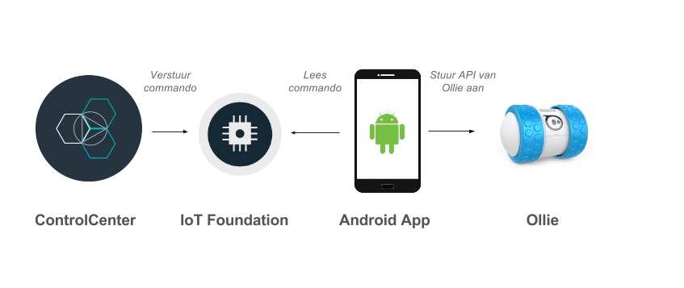

# Hack The Future 2015

*Het is 3 jaar na de fallout en jullie verlaten de vault om voorraad te verzamelen. Anderen liggen
echter op de loer om jullie vault aan te vallen. Het komt er dus op aan om een systeem uit te werken waardoor jullie de vault vanop afstand kunnen bewaken*

Item | Omschrijving
------------- | -------------
ControlCenter  | We hebben in deze repository 2 applicaties gestoken die jullie kunnen gebruiken om van start te gaan. Eén op basis van [Spring Boot](http://projects.spring.io/spring-boot) en één op basis van [ExpressJs](http://expressjs.com). Het ControleCenter wordt de webapplicatie die jullie aanspreken vanop afstand.
IOT Foundation | De [IoT Foundation](https://www.ng.bluemix.net/docs/#services/IoT/index.html) fungeert als message broker.
Android App | 
Ollie | 